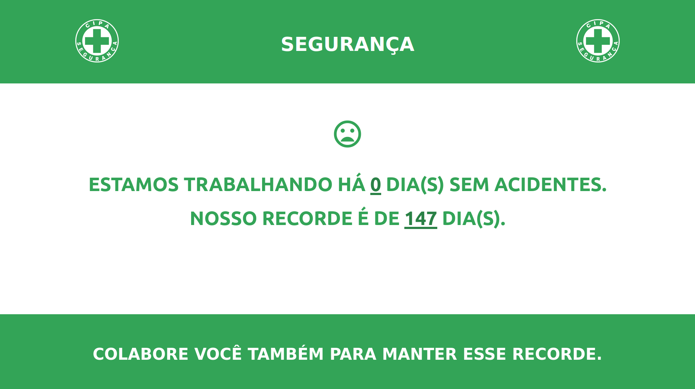

# PLACA CIPA PARA CONTAGEM DE DIAS SEM ACIDENTES
*Contador automátco de dias sem acidentes usado pela  **CIPA***

[Demo aqui](https://jeanrafaellourenco.github.io/placa-cipa-para-contagem-de-dias-sem-acidentes/)

A data do último acidente e o récorde de dias sem acidentes podem ser alteradas no arquivo `script.js`.

  

*Obs, **css** não é meu forte.*
